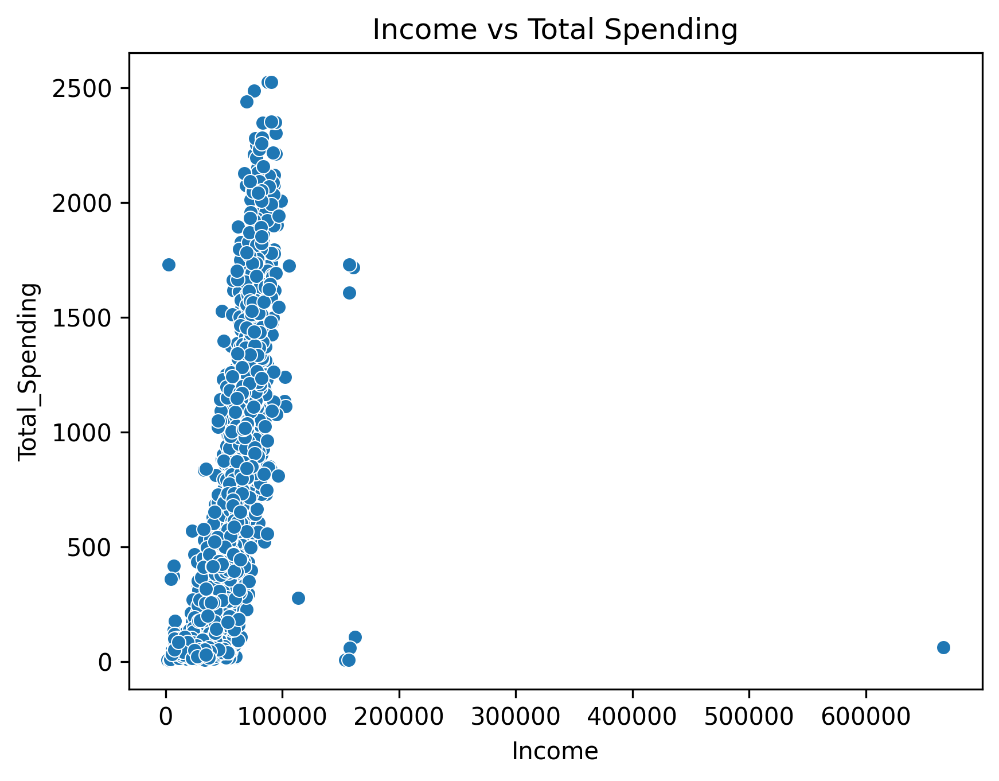
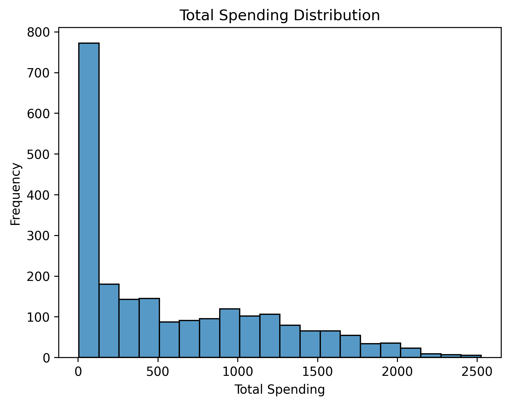
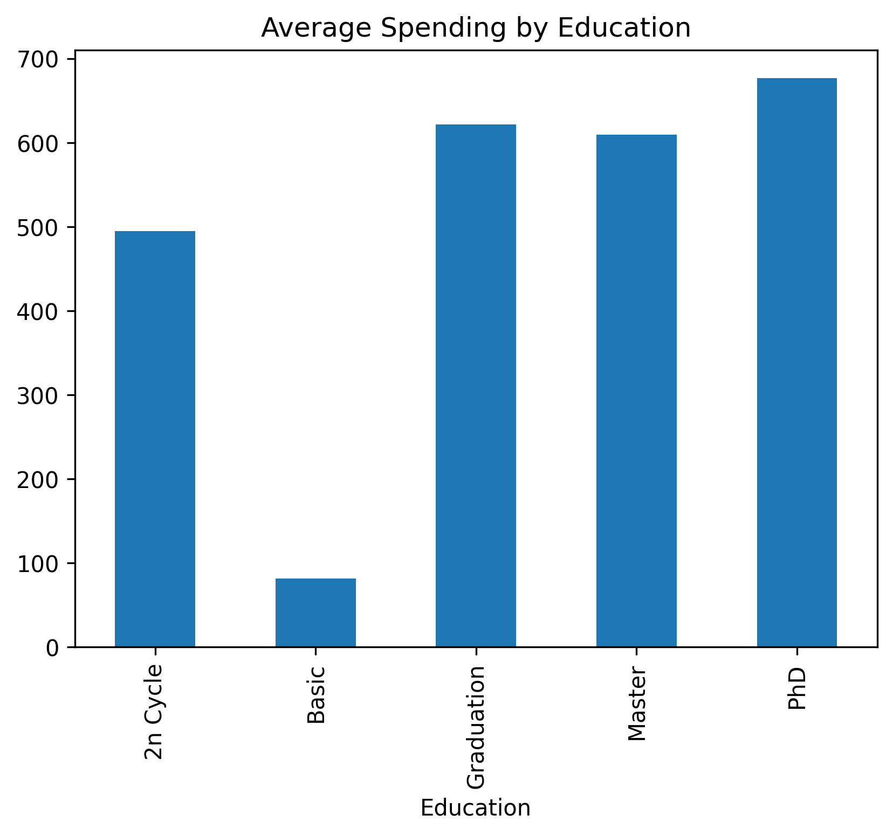
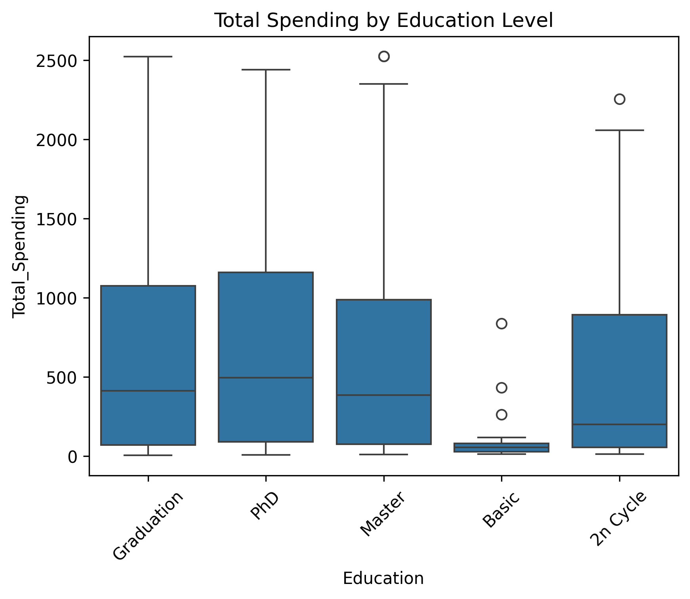

# Customer Personality Analysis

A business data analytics and machine learning project focused on understanding customer purchasing behavior and predicting marketing campaign responses using data-driven techniques.

---

# Project Preview

## Income vs Total Spending



Strong positive relationship observed between customer income and total spending.

---

## Total Spending Distribution



Most customers belong to the low-to-medium spending segment, while a relatively small number of customers contribute a significant portion of total revenue.

---

## Average Spending by Education



Customers with higher education levels generally demonstrate higher average spending behavior.

---

# Business Questions

This project aims to answer the following business questions:

1. Which customer groups contribute the most revenue?
2. Does customer income influence spending behavior?
3. Does education level affect purchasing patterns?
4. Are there significant differences between customers who respond to marketing campaigns and those who do not?
5. Can machine learning be used to predict campaign responses?

---

# Dataset

Dataset: Customer Personality Analysis  
Source: https://www.kaggle.com/datasets/imakash3011/customer-personality-analysis  

Records: 2,240 customers  
Features: 29 variables  

---

# Tools and Technologies

- Python  
- Pandas  
- NumPy  
- Matplotlib  
- Seaborn  
- SciPy  
- Scikit-learn  
- Jupyter Notebook  

---

# Project Workflow

Data Cleaning → Feature Engineering → EDA → Statistical Analysis → Customer Segmentation → Machine Learning → Insights

---

# Exploratory Data Analysis

## Spending Distribution

The spending distribution is highly right-skewed.

Most customers are concentrated in the lower spending range, while a small group contributes disproportionately high spending.

---

## Education and Spending

### Total Spending by Education



Key observations:
- PhD customers show highest median spending
- Graduation and Master groups are similar
- Basic education customers spend significantly less

---

### Average Spending by Education


Education shows a positive relationship with spending.

---

## Income vs Spending


There is a strong positive relationship between income and spending (correlation = 0.668).

---

# Customer Segmentation

| Segment | Customers |
|----------|----------|
| Low Spending | 1231 |
| Medium Spending | 387 |
| High Spending | 598 |

---

# Statistical Analysis

t-statistic = 6.316  
p-value = 3.23 × 10⁻¹⁰  

Income significantly affects marketing campaign response.

---

# Machine Learning Model

Logistic Regression  

Accuracy: 83.1%

---

# Key Insights

- Income strongly influences spending behavior  
- Higher education correlates with higher spending  
- High-value customers contribute most revenue  
- Income affects campaign response  
- Machine learning can predict responses  

---

# Repository Structure

```text
Customer-Personality-Analysis/
├── README.md
├── requirements.txt
├── .gitignore
├── marketing_campaign.csv
├── Customer Personality Analysis and Machine Learning Report.pdf
├── notebooks/
│   └── customer_personality_analysis.ipynb
├── figures/
│   ├── income_vs_spending.png
│   ├── spending_distribution.png
│   ├── spending_by_education_boxplot.png
│   └── average_spending_by_education.png
```

---

# Author

Li Wenjian

# Skills Demonstrated

- Data Cleaning
- Exploratory Data Analysis
- Statistical Analysis
- Machine Learning
- Data Visualization